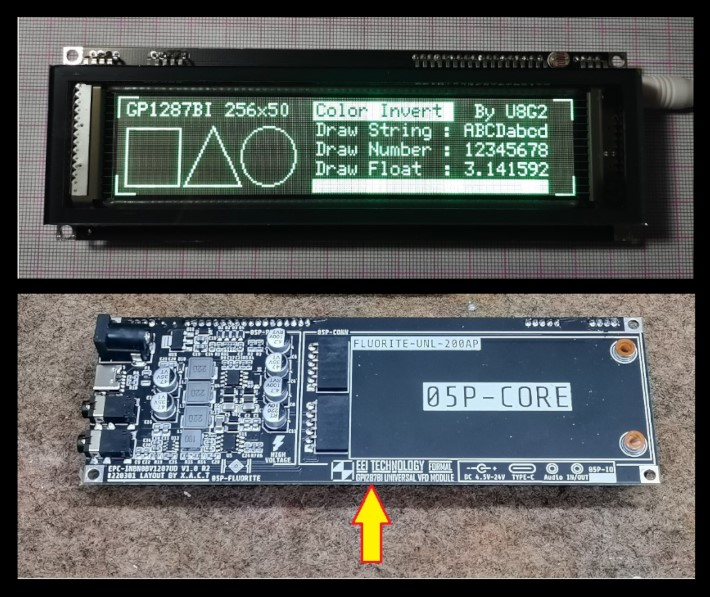

# GP1287 / GP1294 / 05P-CORE  
## 256×50 Graphic VFD Documentation & ESP32 Examples



This repository exists because **documentation for this VFD is scattered, inconsistent, and at risk of disappearing**.

The display commonly sold as **VFD256x50 GP1287** is also found labeled **05P-CORE** and under several other unrelated-looking part numbers. This repo consolidates **verified datasheets**, **pinouts**, and **working ESP32 Arduino code** so this hardware can be reused without guesswork or repeated reverse-engineering.

---

## What this repository is

- A **technical reference** for the 256×50 graphic VFD family
- A **public archive** for the known controller datasheet
- A place to document **real, tested ESP32 behavior**
- A map of **all known aliases and module names**

---

## What this repository is NOT

- Not official vendor documentation  
- Not a consumer tutorial  
- Not tied to one PCB revision  

This is **engineering documentation**, not marketing material.

---

## Display Overview

- Display type: **Graphic Vacuum Fluorescent Display (VFD)**
- Resolution: **256 × 50 pixels**
- Interface: **SPI (serial)**
- Controller family: **GP12xx**
- Typical supply voltage: **5 V**
- Logic level compatibility: **3.3 V (ESP32-safe)**

---

## Known Names / Aliases

This same or near-identical display has been observed under the following names:

- **VFD256x50 GP1287**
- **GP1287 Graphic VFD**
- **05P-CORE**
- **GP1294AI-based VFD**
- **INBN0BV1294UD**
- **EPC-INBN0BV1294UD**
- **256×50 Graphic VFD Module**
- **256x50 SPI VFD Display**
- Various unbranded / surplus OEM listings

In practice, these modules:

- Use the same SPI command structure
- Belong to the same GP12xx controller family
- Differ mainly in silkscreen labels and PCB layout

---

## Datasheet (Archived)

This repository includes an archived copy of the most complete publicly available datasheet:

```

EPC-INBN0BV1294UD_SPEC.pdf

```

This document provides:

- Pin definitions
- Electrical characteristics
- SPI timing diagrams
- Reset and filament control requirements
- Core command set used by GP12xx controllers

Even when the module is labeled **GP1287** or **05P-CORE**, this datasheet has proven to accurately describe real hardware behavior.

---

## Pinout Summary (Typical)

> ⚠️ Always confirm against your specific PCB silkscreen

| Signal        | Description                                  |
|---------------|----------------------------------------------|
| FILAMENT_EN   | Enables VFD heater (must be HIGH)            |
| CLOCK         | SPI clock                                    |
| DATA          | SPI data (MOSI)                              |
| CS            | Chip select (active LOW)                     |
| RESET         | Reset (active LOW)                           |
| GND           | Ground                                       |
| +5V           | Display power input                          |

Failure to drive **FILAMENT_EN** HIGH will result in a blank display even if SPI communication is working.

---

## ESP32 Support

Included in this repository:

- Working **Arduino ESP32 sketch**
- Uses the **U8g2 library**
- Software SPI for safety and compatibility
- Explicit handling of:
  - Filament enable
  - Reset polarity
  - Power sequencing

This configuration has been validated on standard ESP32 dev boards.

---

## Repository Structure

```

.
├── README.md
├── vfd.jpeg
├── EPC-INBN0BV1294UD_SPEC.pdf
└── esp32/
└── vfd_hello_world.ino

```

- `vfd.jpeg` – Reference photo of the physical display module
- `EPC-INBN0BV1294UD_SPEC.pdf` – Archived datasheet
- `esp32/` – Arduino / ESP32 example code

---

## Why this repo exists

This display:

- Appears frequently in surplus markets
- Ships under multiple misleading names
- Has no single authoritative documentation source
- Is trivial to drive once the basics are known

The goal is simple:

**Make the GP1287 / 05P-CORE VFD usable without tribal knowledge.**

---

## Contributions

If you have:

- A different PCB revision
- Another datasheet or service manual
- Confirmed pinout variations
- Logic analyzer captures or timing measurements
- Code for other MCUs

Open an issue or submit a PR.

---

## License

Documentation and example code are provided for educational and archival purposes.  
Use at your own risk.
